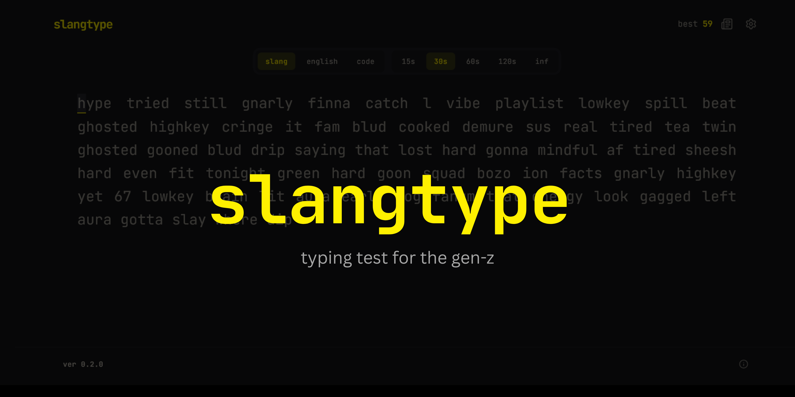

# SlangType
[](https://slangtype.vercel.app)




> A modern typing speed test with support for slang. Test your typing speed with slang, English, or code, across various time challenges and infinite mode.

## Features

- **Multiple Languages**: Test with slang, English, or code snippets
- **Various Modes**: 15s, 30s, 60s, 120s, and infinite mode
- **Display Modes**: Default and bold display.
- **Statistics Tracking**: WPM, accuracy, errors, and detailed performance metrics
- **History**: View all typing attempts with detailed analytics
- **Themes**: Dark, light, latte, frappe, mocha, nord and more themes
- **Responsive Design**: Fully optimized for mobile and desktop
- **Local Persistence**: Your history and settings are saved locally

## Why Slangtype?
Slangtype is inspired from [monkeytype.com](https://www.monkeytype.com/). I wanted to build a custom typing test and Monkeytype didn't support slang, so I made this specially for the slangs that (mostly) Gen Z uses. Also, the AI-powered custom word sets turned out to be a great addition for those who want a purely custom experience without having to find a word dataset themselves.

## Get Started

```bash
# Clone the repository
git clone infinotiver/slang-type.git

# Install dependencies
pnpm install

# Start development server
pnpm dev

# Build for production
pnpm build
```


## Credits

Made with ❤️ by [infinotiver](https://github.com/infinotiver)
